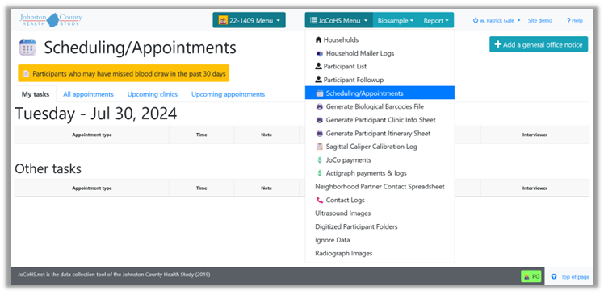
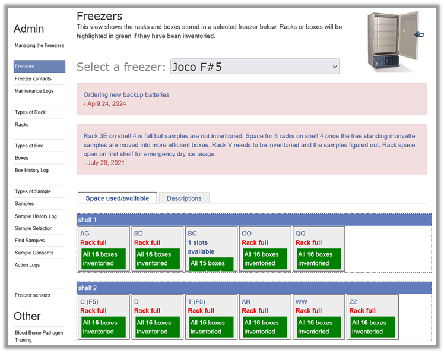
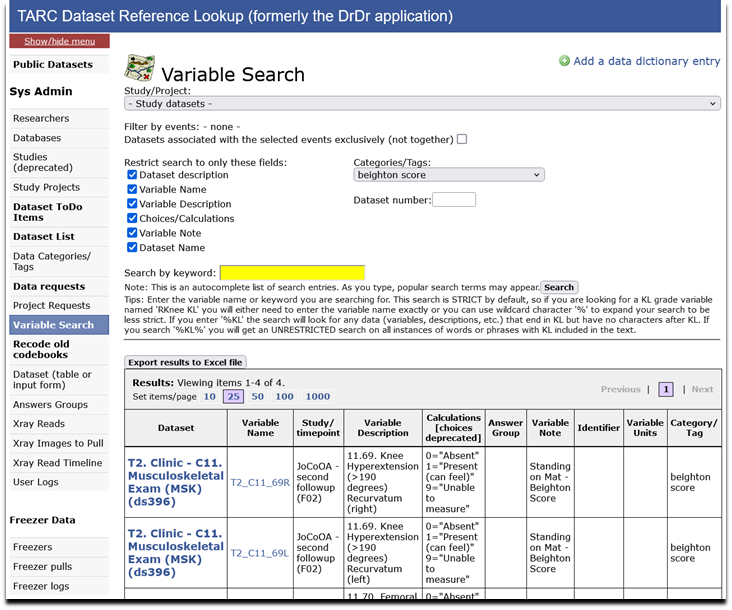
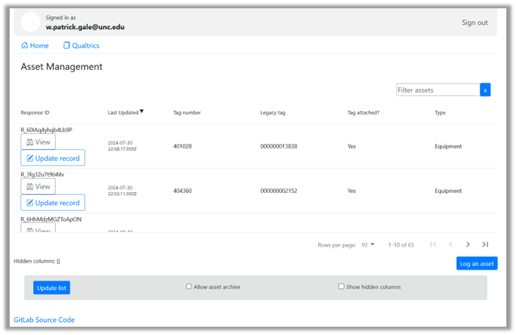

Screenshots of my recent web applications developed for TARC (can move these to a Jupyter notebook to be placed in the Entry Portal prototype):

JoCo Health Study data collection web app.

FM2013 web app.

Dataset reference library web app.

Capital assets tracking web app.

 

